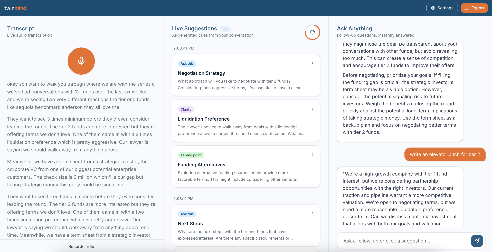

# TwinMind Live Suggestions

TwinMind is a composed, real-time meeting copilot.
You talk, it listens, and every cycle it gives three actually useful suggestions.
Think better questions to ask, claims to verify, and smart lines you can use right away.

[Live app](https://twinmind-live-spark.vercel.app)

---

## Working run

This screenshot shows transcript streaming, suggestions, and chat working in one session.



---

## Setup

Get a Groq API key from [console.groq.com](https://console.groq.com) and run

```bash
git clone https://github.com/agrawalreva/twinmind-live-spark
cd twinmind-live-spark
npm install
npm run dev
```

Open the app, add your key in Settings, enable microphone access, and start recording.

---

## Technical stack

React, TanStack Router, Vite, Tailwind, and shadcn/ui.
Groq handles transcription with Whisper Large V3.
Groq also handles suggestions and chat with `llama-3.3-70b-versatile`.
The app is deployed on Vercel as a client side SPA.

---

## Prompt quality

Early prompts produced polished but repetitive output.
Quality improved when prompts were structured in steps.
The model now reads conversation state first, then chooses suggestion mix, then writes transcript specific output.
This made suggestions sharper and more useful in real meetings.

Deduplication is built into every cycle.
Previously shown suggestions are passed back so the model avoids repeats.
Without this, long meetings quickly produce near duplicates.

Suggestion context is short by design so timing stays tight.
Chat context is longer so follow ups stay grounded.

---

## Audio note

Chrome MediaRecorder emits fragmented MP4 or WebM data.
Single chunks are often not complete standalone files.
Sending each chunk alone caused unstable transcription behavior.

The stable approach is to accumulate chunks, send a growing blob, and diff new text from the previous transcript result.
This is the most reliable behavior in real meetings.

---

## Rendering mode

This app depends on browser APIs such as MediaRecorder and AudioContext.
A pure client SPA keeps this stable and predictable.
It also avoids hydration mismatch issues for microphone first workflows.

---

## Next improvements

Transcript diff can still split a sentence in edge cases.
Meeting type is detected once and should become adaptive over time.

Both are straightforward to improve with better segmentation and periodic reclassification.
